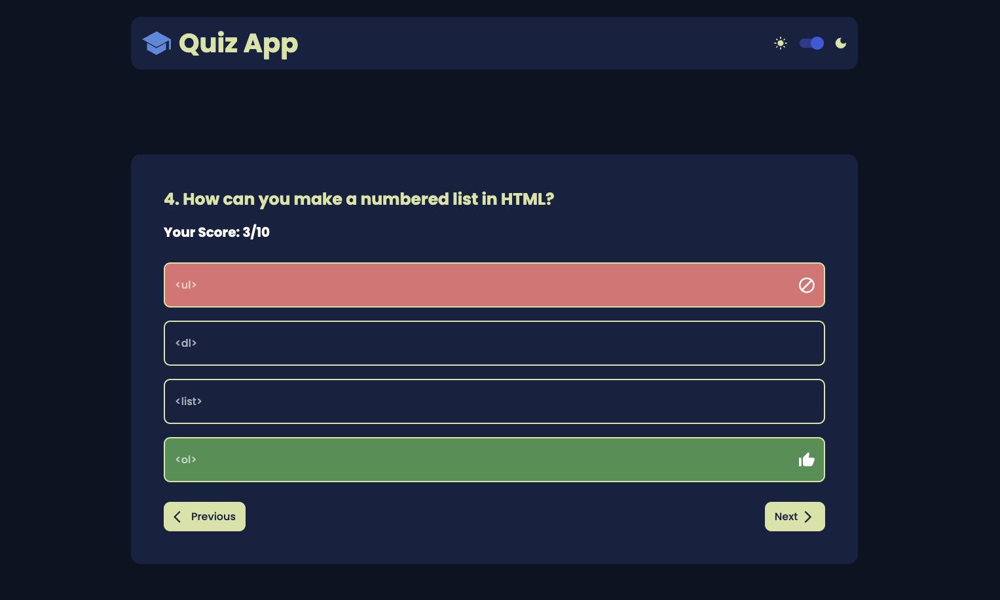
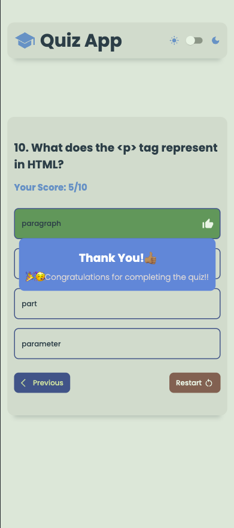

# Quiz App

Welcome to the **Quiz App**, a responsive and dynamic quiz application that allows users to test their knowledge on various subjects with an interactive experience.

## Live Demo

Check out the live demo of the project here: [Quiz App Live Site](https://victorkevz.github.io/quiz-app/)

## Features

- **Responsive Design**: The app is fully responsive and works smoothly across devices.
- **Dark Mode & Light Mode**: Users can switch between dark and light themes, with the preference saved using local storage.
- **Local Storage**:
  - Theme and selected subject preferences are saved, allowing users to return to their previously selected settings.
- **Interactive Feedback**:
  - Audio feedback is provided when selecting answers.
  - If a wrong answer is selected, the correct answer is shown for learning purposes.
- **Smooth Animations**: Includes transitions and animations for a dynamic user experience.

## Future Enhancements

In future updates, the following functionalities will be added:
- **Saving Answers to Local Storage**: Progress will be stored so users can resume the quiz from where they left off.
- **Quiz Timeout**: A timer will be implemented to limit the time available for the entire quiz.
- **Full Accessibility**: Enhancements will include keyboard focusability and focus trapping to ensure an accessible experience for all users.

## How to Run the Project

To run this project locally, follow the steps below:

1. Clone the repository:

   ```bash
   git clone https://github.com/VictorKevz/quiz-app.git
   ```

2. Navigate to the project directory:

   ```bash
   cd quiz-app
   ```

3. Open `index.html` in your preferred web browser.

## Technologies Used

- **HTML5**: Structure and content.
- **CSS3**: Styling, responsiveness, and theming (light/dark modes).
- **JavaScript (ES6+)**: Logic for dynamic interactions and state management.
- **Local Storage**: To store the theme and selected subject.
- **Framer Motion**: For animations and smooth transitions.
- **Audio Feedback**: Added for an enhanced interactive experience.

## Credits

- Quiz icon by [Icons8](https://icons8.com)
  - [Quizizz Icon](https://icons8.com/icon/5mA1jutZIt5b/quizizz)
## Contributing

If you'd like to contribute to the project, feel free to fork the repository and create a pull request with your enhancements.

